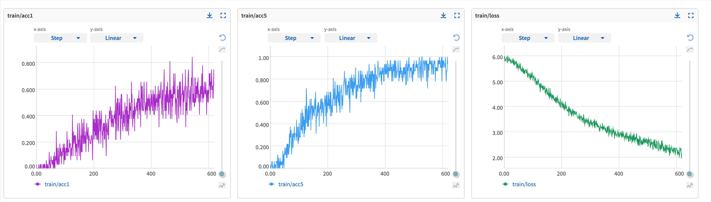

# Benchmark ML Experiment Tracking Tools

  

This repo is a benchmark for ML experiment tracking tools. We build some ML projects from scratch and upgrade them with different experiment tracking tools. The goal is to provide a detailed comparison of different experiment tracking tools, so users can choose the best one for their projects.

- *Training* and *Inference* are supported.
- *Experiment management* with
    - [x] hydra
    - [x] tensorboard
    - [x] neptune.ai
    - [ ] wandb
    - [ ] mlflow
- *Various Frameworks and Models*
    - [x] PyTorch Vision for Scene Classification
    - [ ] TIMM for Image Classification
    - [ ] HuggingFace for NLP

- *Model Zoo* with pretrained models

## :rocket: Installation

```bash
# Download the code
git clone git@github.com:MLSysOps/ml_exp_tracking_benchmark.git
cd ml_exp_tracking_benchmark

# Create a conda environment
conda create -n ml_track_benchmark python=3.8
conda activate ml_track_benchmark

# Install dependencies
pip install - r requirements.txt
```

## :running_woman: Quick Start

Please download the data from [[Place2 Data]](http://places2.csail.mit.edu/download.html)

```shell
# 1. Download and unzip the data
sh download_data_pytorch.sh

# 2. Train a model
export PYTHONPATH=$PYTHONPATH:$(pwd)
python benchmark/main.py ml_track_framework=tensorboard
```

## :hammer: Results

### :fire: Neptune.ai



## :grinning: Model Zoo (Pretrained Models)

Please refer [[Model Zoo]](model_zoo.md)

## :tada: Acknowledge

The dataset and basic code comes from [[MIT Place365]](https://github.com/CSAILVision/places365)

Thanks for the great work!
